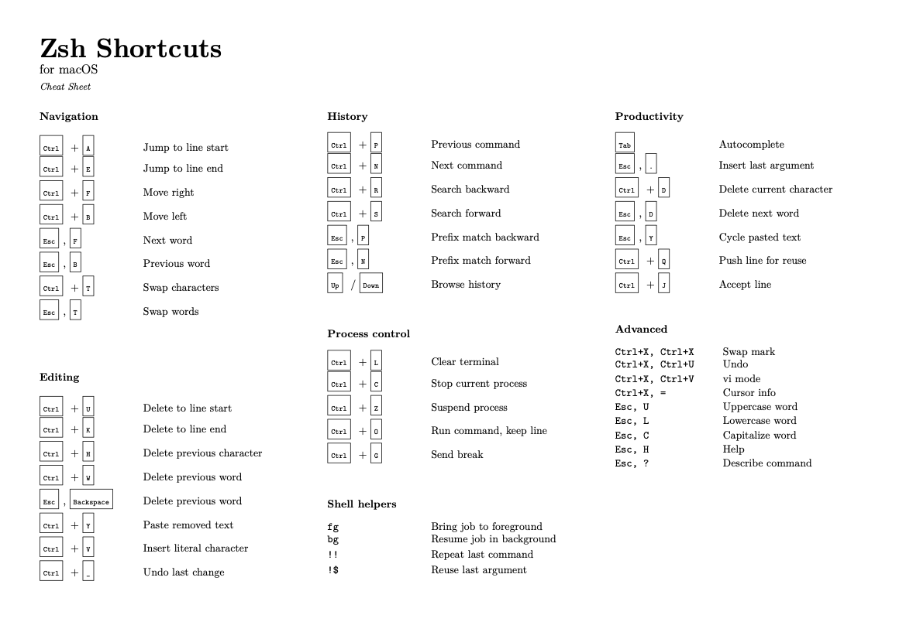

# Zsh Shortcuts for macOS

A compact one-page cheat sheet for Zsh on macOS.

I couldn't find a simple and clean reference that worked for me, so I built one myself.

## Preview

## Download

You can download the PDF here:
[zsh-shortcuts.pdf](zsh-shortcuts.pdf)

## Notes

- Designed for macOS default Zsh keybindings
- Focused on usability, not completeness
